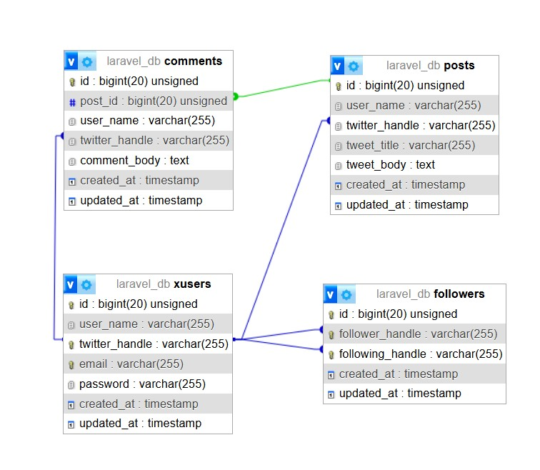
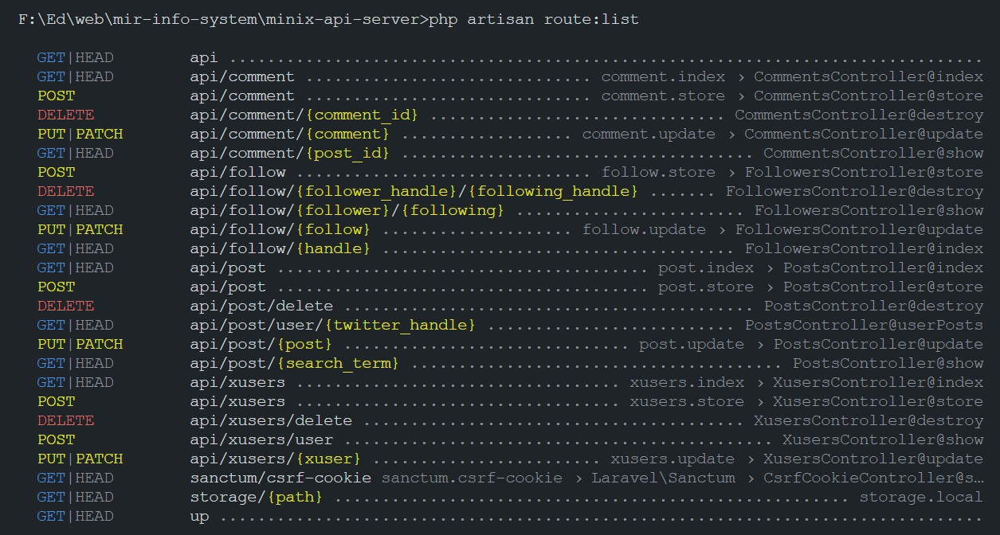
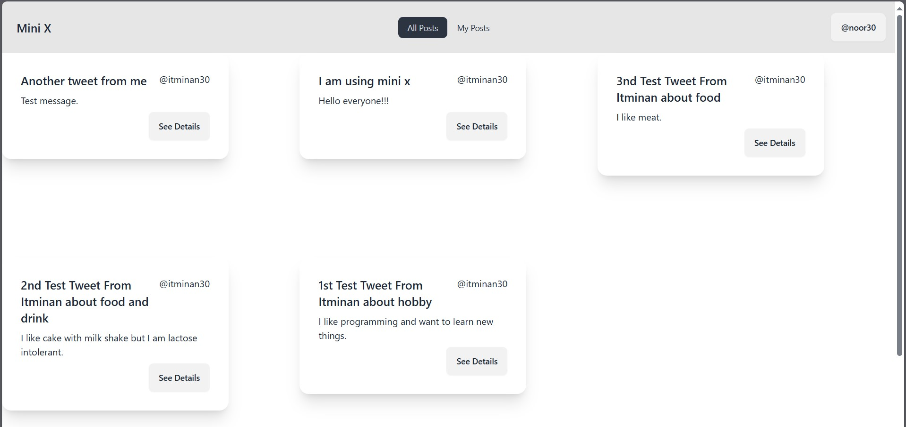
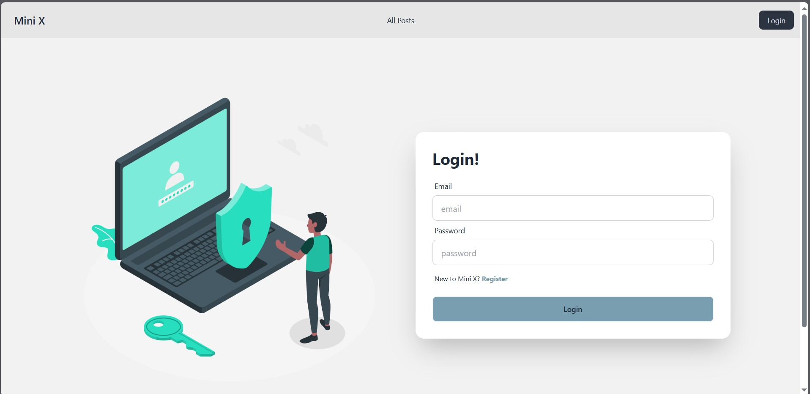
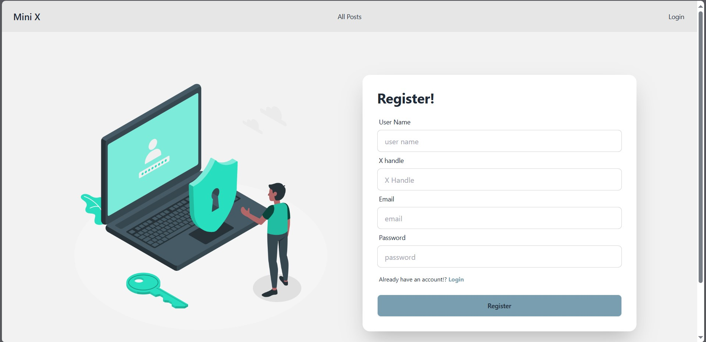
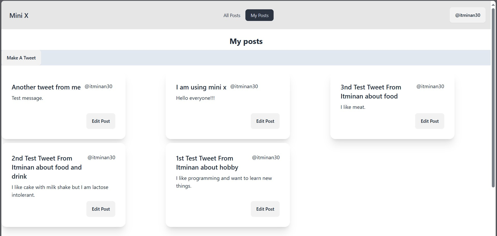
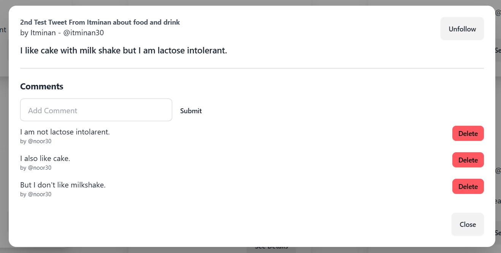
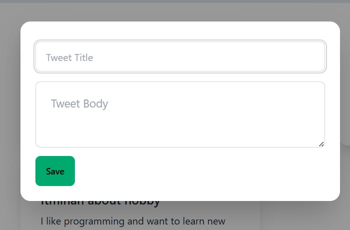
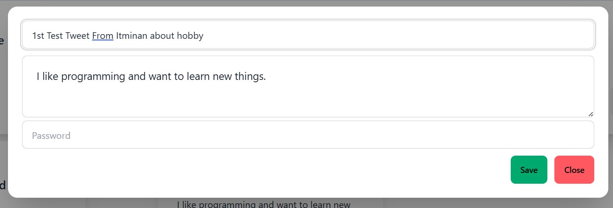

# Mini X

Mini X is a miniature Twitter application where users can:
- Sign up and sign in
- Create tweets
- Follow other users
- Comment on tweets

## Tech Stack

### Backend
- **Laravel**
- **MySQL**
- **Laravel API**

### Frontend
- **React.js**
- **TailwindCSS**
- **React Router**
- **DaisyUI** (component library)

---

## Features
- User authentication (Sign up/Sign in)
- Posting and managing tweets
- Following and interacting with other users
- Commenting on tweets

---

## Installation and Usage

### Frontend
1. Clone the repository.
2. Navigate to the frontend directory.
3. Install dependencies:
   ```bash
   npm install
   ```

### Backend
1. Install **XAMPP**.
2. Start the Apache and phpMyAdmin servers in XAMPP.
3. Create a new database:
   - Database name: `laravel_db`
4. Import the provided database file:
   - Locate the database file in the `resources` folder of the repository.
5. Start the backend server:
   ```bash
   php artisan serve
   ```

---

## Screenshots

### Database Schema


### API Endpoint List


### Home Page


### Login Page


### Registration Page


### My posts Page


### Tweet Detail Modal


### Create Tweet Modal


### Tweet Edit Modal


---

## Acknowledgments

Special thanks to the creators and contributors of the following technologies:
- Laravel
- React.js
- TailwindCSS
- DaisyUI
